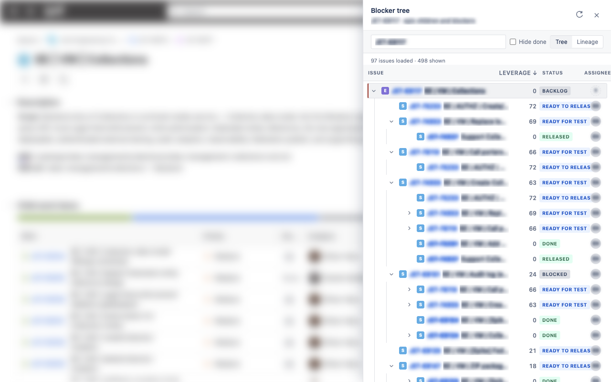
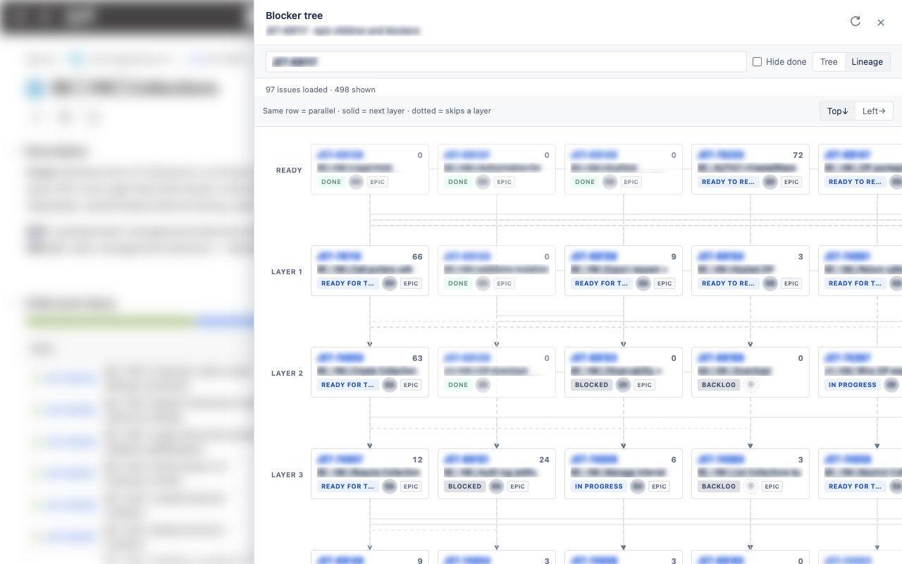

# Jira Blocker Tree

A Chrome extension for **anyone on Jira Cloud**. It works on every `https://*.atlassian.net` site you are already logged into. There is no tenant config, OAuth, or API token.

On an issue or epic page (`/browse/KEY`, `/jira/…`, or `/issues/…`) it opens a collapsible **Blocker tree** of:

- Issues under the epic (`parentEpic = KEY`)
- Inward **Blocks** links (`is blocked by`), including cross-project blockers

Each row shows issue key, summary, status, assignee, and a leverage count when the issue blocks others. **Lineage** lays the same graph out by layer so you can see what is parallel vs what is waiting on something else.

The site comes from the tab you have open, not a build-time hostname.





## Install

1. Install **Jira Blocker Tree** from the [Chrome Web Store](https://chrome.google.com/webstore) (search the name if you do not have the listing URL yet).
2. Open any Jira Cloud issue while you are logged in.
3. Click **Blockers** in the issue header (next to Automation) to open the drawer, or click the extension icon for the **side panel**.

Until the listing is live, you can still load it unpacked: `npm install && npm run build`, then **Load unpacked** on `chrome://extensions` and pick the `dist` folder.

## Usage

1. Open any issue, e.g. `https://your-site.atlassian.net/browse/PROJ-123` or a `/jira/...` board/issue view.
2. Click **Blockers** in the issue header action row.
3. Use **Refresh** after changing links, **Hide done** to filter completed work, and **Tree** / **Lineage** to switch views.

The walker uses the link type **Blocks** (inward: `is blocked by`, outward: `is blocking`). Depth and node caps prevent runaway graphs.

## Privacy

The extension uses your existing Jira browser session (`credentials: include`). It only talks to the `*.atlassian.net` origin of the tab you have open. It does not send issue data to a third-party server. See [docs/PRIVACY.md](docs/PRIVACY.md).

## Requirements (development)

- Node.js 20+
- Chrome (Manifest V3, side panel support recommended)
- Logged-in session on a Jira Cloud site (`*.atlassian.net`) in the same browser profile

## Setup (development)

```bash
cd jira-blocker-tree
npm install
npm run build
```

Optional: copy `.env.example` to `.env` and set `JIRA_ORIGIN` so debug scripts (`npm run chrome`, `npm run inspect`) know which site to open. The packaged extension does not use that value.

Load unpacked in Chrome:

1. Open `chrome://extensions`
2. Enable **Developer mode**
3. **Load unpacked** and select the `dist` folder (after `npm run build`)

## Performance

Issues are loaded breadth-first, one batched request per level:

- Root issue and `parentEpic` children load in parallel
- Each deeper level resolves through `key in (...)` searches, 50 keys per request, batches in parallel
- The service worker caches a built tree for 60 seconds and de-duplicates concurrent builds, so reopening the drawer is instant

**Refresh** always bypasses the cache.

## Development

### Shared debug browser (recommended)

This is the workflow that lets a coding agent see the same browser you do.

```bash
npm run dev      # terminal 1: Vite dev server, auto-reloads the extension on save
npm run chrome   # terminal 2: launches the debug Chrome and installs dist/
```

`npm run chrome` starts Chrome with a dedicated profile under `.devtools/chrome-profile`
and remote debugging on port 9222, then installs `dist/` over CDP. Log into Jira once
in that window; the profile persists, so later launches skip the login.

Inspect what the extension is doing at any time:

```bash
npm run inspect                      # current Jira tab
npm run inspect -- --reload          # reload the page first
npm run inspect -- --open            # click Blockers and wait for the tree
npm run inspect -- --url=<issue-url>
```

It reports whether the launcher and drawer mounted, how many rows rendered, any
page errors and console output, and writes a screenshot to `.devtools/shot.png`.

```bash
npm run reload       # reinstall dist/ over CDP after a manual build
npm run extensions   # list loaded extensions, screenshot chrome://extensions
```

### Why a separate Chrome profile

Chrome cannot enable the debugging port on a profile that is already open, so
the debug browser has to be its own instance.

Chrome 137 also removed the `--load-extension` switch, so the extension is
installed after launch through the CDP `Extensions.loadUnpacked` command, which
is why the browser starts with `--enable-unsafe-extension-debugging`. CDP-installed
extensions do not survive a restart, so `npm run chrome` reinstalls on every launch.

Do not use `--disable-extensions-except` with this setup; it silently suppresses
the CDP-installed extension.

### Plain workflow

```bash
npm run build:watch   # rebuild on save, no auto-reload
```

Then click **Reload** on the extension card in `chrome://extensions` and refresh
the Jira tab, since the already-injected content script keeps running old code.

Shared logic lives under `src/shared/`:

- `jira/client.ts` – session REST calls (`credentials: include`, `X-Atlassian-Token: no-check`) and batched key lookups
- `buildBlockingTree.ts` – level-by-level prefetch and tree assembly

UI lives under `src/ui/`. The content script renders the drawer inside a shadow root so Jira's global CSS cannot affect it, and injects the header button via `src/content/mountPoints.ts`, which re-attaches the button whenever Jira re-renders the issue header.

## Optional: Forge issue panel

To ship the same UI as a native Jira panel for a Cloud site, reuse the same modules in a Forge app:

1. Copy `src/shared/`
2. Replace `jira/client.ts` fetch with Forge `requestJira` (`asUser()`)
3. Mount the same React tree in a `jira:issuePanel` UI Kit or Custom UI resource
4. Pass the issue key from Forge context instead of the browse URL

The Chrome extension does not need that. It uses the visitor's existing Jira session.

## Chrome Web Store and GitHub releases

Listing copy, screenshots, privacy URL, and automated publish on GitHub release: [docs/CHROME_WEB_STORE.md](docs/CHROME_WEB_STORE.md).

## License

Copyright 2026 Ethan Hess. Licensed under the [Apache License 2.0](LICENSE). See [NOTICE](NOTICE) and [CONTRIBUTING.md](CONTRIBUTING.md).
